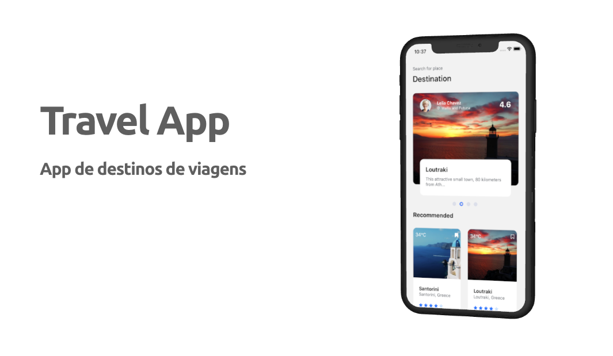
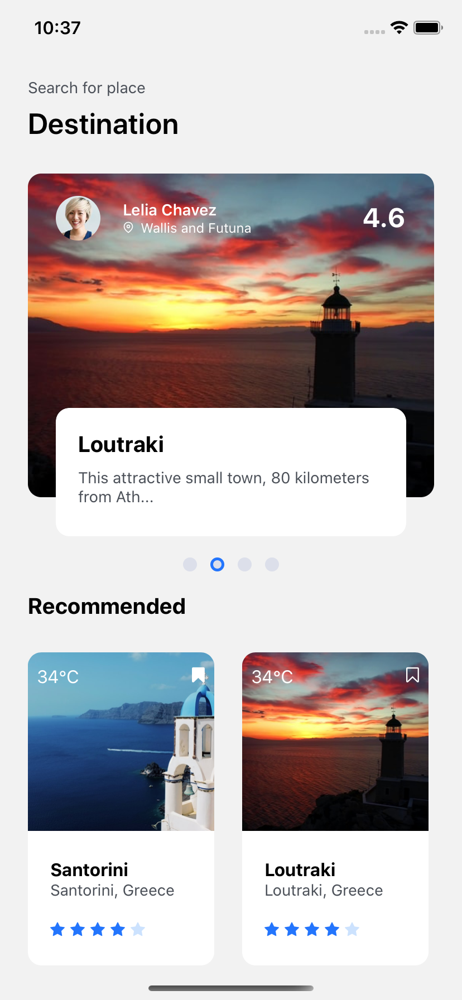
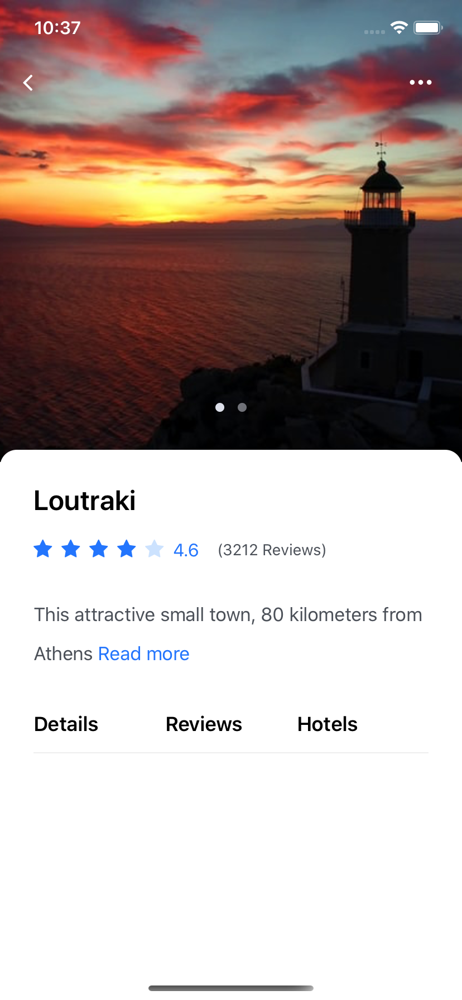
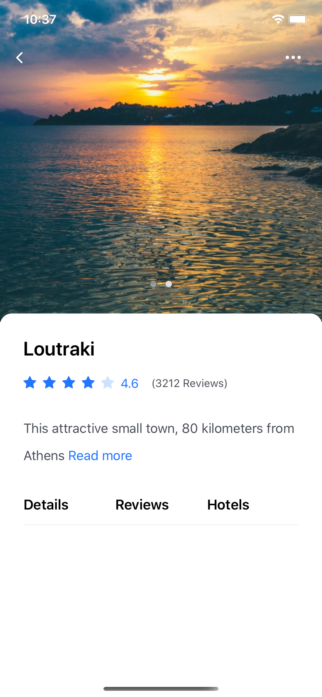

Desenvolvimento de uma interface de app de destinos de viagens.

## :rocket: Tecnologias Utilizadas

O projeto foi desenvolvido utilizando as seguintes tecnologias

- [React Native](https://reactnative.dev/)

  - [React Native Communications](react-native-communications)

- [React Navigation v5](https://reactnavigation.org/)
- [Styled Components](https://styled-components.com/)
- [Expo](https://expo.io/)

## :iphone: Telas

<h4 align="center">
    
    
    
</h4>

<h4 align="center">
    Feito com 💜 by Deusdete Filho</a>
</h4>
